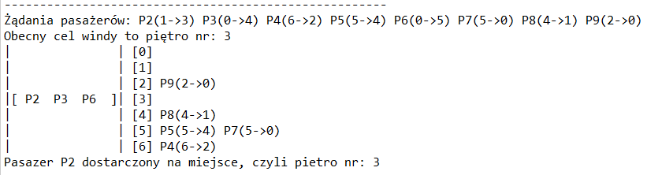

# Multithread elevator
Simple simulator of elevator using multithreading in java. Passengers are generated randomly. The elevator executes passengers orders FIFO-like, but it also accepts additional passengers, if there is space left in the elevator for them. Results of the program running are shown in a simple graphic form in a terminal.

## Results

